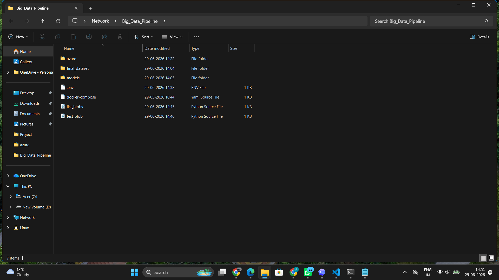
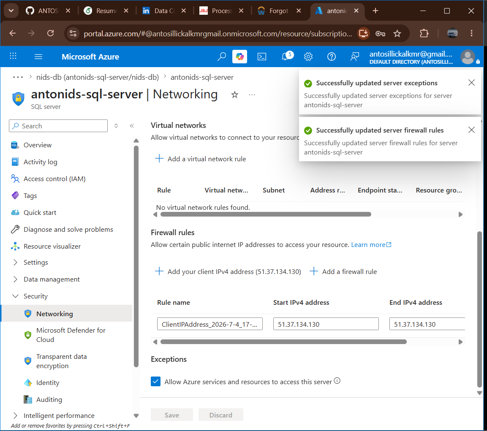
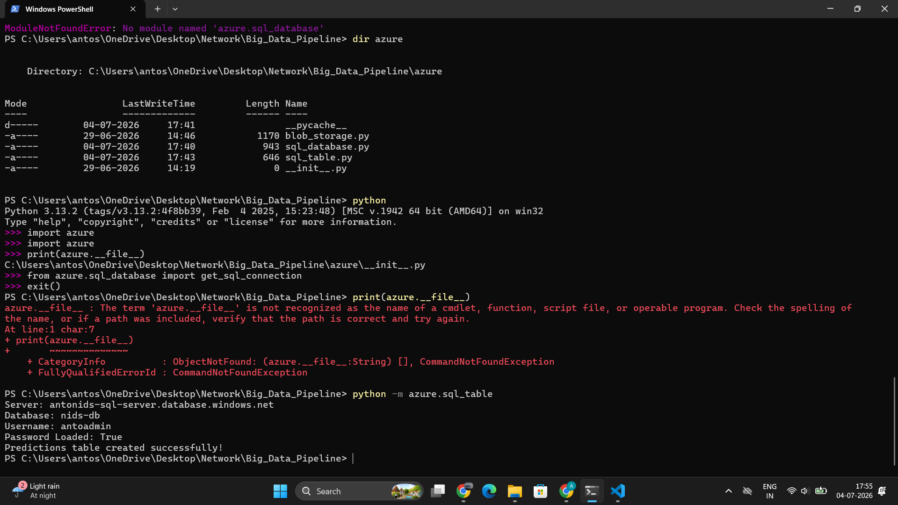
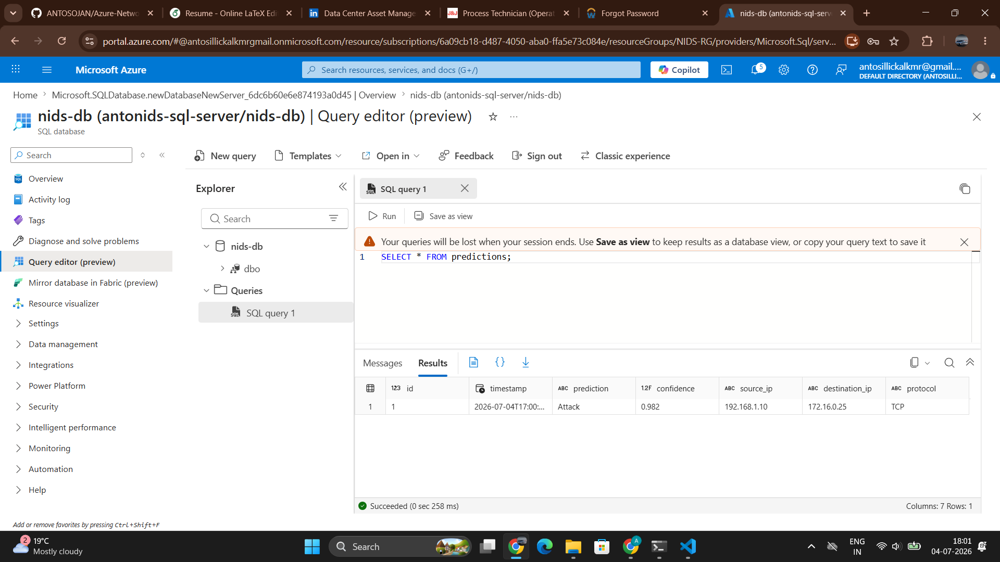

# ☁️ Azure Network Intrusion Detection System

## ☁️ Cloud-Native Real-Time Network Intrusion Detection using Microsoft Azure


---

# 📖 Project Overview

This project is the cloud-native implementation of my MSc dissertation:

> **Real-Time Network Intrusion Detection System using Big Data Technologies and Machine Learning**

The objective is to transform a traditional Network Intrusion Detection System (NIDS) into a scalable cloud-native cybersecurity solution using Microsoft Azure.

Instead of building a sample Azure application, this repository documents the migration of a real-world machine learning and big data project to Azure services phase by phase.

---

# 🎯 Project Objectives

- Build a cloud-native Network Intrusion Detection System (NIDS)
- Learn Microsoft Azure through hands-on implementation
- Replace local infrastructure with Azure cloud services
- Demonstrate cloud engineering and data engineering practices
- Build a production-ready cybersecurity portfolio project

---

# 🚀 Current Features

## ✅ Phase 1 – Azure Blob Storage

- Azure Resource Group
- Azure Storage Account
- Azure Blob Container
- Uploaded preprocessed CICIDS2018 dataset
- Secure environment configuration (.env)
- Azure Blob Storage SDK integration
- Load dataset directly from Azure Blob Storage

---

## ✅ Phase 2 – Azure SQL Database

- Azure SQL Server
- Azure SQL Database
- Firewall configuration
- Secure SQL authentication
- Python connectivity using ODBC Driver 18
- Automatic predictions table creation
- Insert intrusion detection predictions
- Retrieve stored predictions
- Verify records using Azure Query Editor

---

## ✅ Phase 3 – Azure Event Hubs

- Azure Event Hub Namespace
- Azure Event Hub
- Event Producer
- Event Consumer
- Real-time Network Traffic Streaming
- Machine Learning Prediction Pipeline
- Azure SQL Prediction Logging
- Persistent SQL Database Connection
- Improved SQL Schema
- Modular Production-Style Architecture

  ## ✅ Phase 4 – Azure Databricks

- Azure Databricks Workspace
- Unity Catalog
- Unity Catalog Schema
- Unity Catalog Volume
- PySpark Data Processing
- Data Validation
- Duplicate Removal
- Missing Value Handling
- Parquet Data Storage
- Distributed ETL Pipeline

# 🏗 Current System Architecture

                                       Microsoft Azure

    +-------------------------------------------+
    |         Azure Blob Storage                |
    |      balanced_dataset.csv (Raw Data)      |
    +-------------------+-----------------------+
                        |
                        ▼
    +-------------------------------------------+
    |         Azure Databricks                  |
    |      Unity Catalog + PySpark ETL          |
    |-------------------------------------------|
    | • Read CSV from Unity Catalog Volume      |
    | • Validate Schema                         |
    | • Remove Duplicates                       |
    | • Handle Missing Values                   |
    | • Save Processed Dataset as Parquet       |
    +-------------------+-----------------------+
                        |
                        ▼
    +-------------------------------------------+
    |     Processed Dataset (Parquet)           |
    |          Unity Catalog Volume             |
    +-------------------+-----------------------+
                        |
                        ▼
    +-------------------------------------------+
    |          Azure Event Hubs                 |
    |     Real-Time Network Event Streaming     |
    +-------------------+-----------------------+
                        |
                        ▼
    +-------------------------------------------+
    |      Event Hub Consumer (Python)          |
    |   Reads Events & Invokes ML Prediction    |
    +-------------------+-----------------------+
                        |
                        ▼
    +-------------------------------------------+
    |     Machine Learning Prediction           |
    |     Gradient Boosting Classifier          |
    +-------------------+-----------------------+
                        |
                        ▼
    +-------------------------------------------+
    |        Azure SQL Database                 |
    |   Stores Intrusion Detection Predictions  |
    +-------------------------------------------+
---

# 💻 Technologies Used

## Cloud

-Microsoft Azure
-Azure Blob Storage
-Azure SQL Database
-Azure Event Hubs
-Azure Databricks
-Unity Catalog

## Programming

- Python 3.13

## Python Libraries

- pandas
- pyodbc
- azure-storage-blob
- python-dotenv
- azure-eventhub
- scikit-learn
- joblib
- pyspark

## Database

- Azure SQL
- SQL Server

## Version Control

- Git
- GitHub

---

# 📂 Project Structure

```text
Big_Data_Pipeline/

│
├── azure_services/
│   ├── blob_storage.py
│   ├── eventhub_producer.py
│   ├── eventhub_consumer.py
│   ├── ml_predictor.py
│   ├── sql_database.py
│   ├── sql_logger.py
│   ├── view_prediction.py
│   └── __init__.py
│
├── databricks/
│   ├── Phase4_Databricks_Preprocessing.ipynb
│   └── README.md (optional)
│
├── models/
│   ├── best_ids_model.pkl
│   ├── scaler.pkl
│   └── feature_columns.pkl
│
├── tests/
│   ├── test_blob.py
│   ├── test_eventhub.py
│   ├── test_predictor.py
│   ├── test_stream_dataset.py
│   └── test_sql.py
│
├── screenshots/
│   ├── phase1/
│   ├── phase2/
│   ├── phase3/
│   └── phase4/
│
├── requirements.txt
├── README.md
├── LICENSE
└── .gitignore
```

---

# 📊 Dataset Information

| Attribute | Value |
|-----------|-------|
| Dataset | CICIDS2018 |
| Records | 300,000 |
| Features | 80 |
| Storage | Azure Blob Storage |

---

# ▶️ Installation

## Clone Repository

```bash
git clone https://github.com/ANTOSOJAN/Azure-Network-Intrusion-System.git
```

---

## Install Dependencies

```bash
pip install -r requirements.txt
```

---

## Configure Environment Variables

Create a `.env` file:

```env
# Azure Blob Storage

AZURE_STORAGE_CONNECTION_STRING=YOUR_CONNECTION_STRING
CONTAINER_NAME=datasets
BLOB_NAME=balanced_dataset.csv

# Azure SQL Database

SQL_SERVER=YOUR_SERVER.database.windows.net
SQL_DATABASE=nids-db
SQL_USERNAME=YOUR_USERNAME
SQL_PASSWORD=YOUR_PASSWORD

# Azure Event Hub

EVENT_HUB_CONNECTION_STRING=
EVENT_HUB_NAME=
```

---

# ▶️ Running the Project

## Test Azure Blob Storage

```bash
python tests/test_blob.py

```

---

## Test Azure SQL Connection

```bash
python tests/test_sql.py
```

---

## Create Predictions Table

```bash
python -m azure.create_table
```

---

## Insert Sample Prediction

```bash
python -m azure.insert_prediction
```

---

## View Stored Predictions

```bash
python -m azure.view_predictions
```

```bash
python tests/test_eventhub.py
```

---

---

# Real time Workflow Section

Azure Blob Storage
        │
        ▼
Load Dataset
        │
        ▼
Stream Events
        │
        ▼
Azure Event Hub
        │
        ▼
Event Consumer
        │
        ▼
ML Prediction
        │
        ▼
Azure SQL Database


# 📸 Project Screenshots

---

# ✅ Phase 1 – Azure Blob Storage

### 1️⃣ Azure Resource Group


---

### 2️⃣ Create Azure Storage Account


---

### 3️⃣ Azure Storage Account Successfully Deployed


---

### 4️⃣ Azure Blob Container


---

### 5️⃣ Dataset Uploaded to Azure Blob Storage


---

### 6️⃣ Project Structure (Phase 1)



---

### 7️⃣ Dataset Successfully Loaded from Azure Blob Storage


---

# ✅ Phase 2 – Azure SQL Database

### 8️⃣ Updated Project Structure


---

### 9️⃣ Azure SQL Firewall Configuration



---

### 🔟 Successful Azure SQL Connection


---

### 1️⃣1️⃣ Predictions Table Created



---

### 1️⃣2️⃣ Azure SQL Query Editor


---

### 1️⃣3️⃣ Prediction Stored Successfully



---

# ✅ Phase 3 – Azure Event Hubs & Real-Time Streaming

### 1️⃣4️⃣ Azure Event Hub Namespace


---

### 1️⃣5️⃣ Event Hub Deployment Completed


---

### 1️⃣6️⃣ Azure Event Hub Created


---

### 1️⃣7️⃣ Azure Storage Networking Configuration


---

### 1️⃣8️⃣ Predictions Stored in Azure SQL Database


---

### 1️⃣9️⃣ Real-Time Event Streaming


---

### 2️⃣0️⃣ Event Consumer Processing Output


---
---

## Azure Databricks ETL

The Databricks notebook performs:

- Reads the CICIDS2018 dataset from a Unity Catalog Volume
- Validates the dataset schema
- Removes duplicate records
- Handles missing values
- Saves the processed dataset in Parquet format
- Stores the processed dataset inside Unity Catalog for downstream processing

# 🎓 Skills Demonstrated

-- Microsoft Azure
- Azure Blob Storage
- Azure Event Hubs
- Azure SQL Database
- Machine Learning
- Gradient Boosting Classifier
- Event-Driven Architecture
- Real-Time Data Streaming
- Python
- Cloud Computing
- Data Engineering
- SQL
- Git & GitHub

---

# 🗺 Azure Migration Roadmap

| Phase | Description | Status |
|--------|-------------|--------|
| Azure Blob Storage | Cloud storage for the CICIDS2018 dataset | ✅ Completed |
| Azure SQL Database | Store intrusion detection predictions | ✅ Completed |
| Azure Event Hubs | Real-time network traffic streaming | ✅ Completed |
| Azure Databricks | PySpark ETL pipeline with Unity Catalog and Parquet processing | ✅ Completed |
| Azure Machine Learning | Deploy the IDS model as a managed endpoint | ⏳ Next |
| Power BI Dashboard | Real-time visualization of prediction results | ⏳ Planned |
| Azure Key Vault | Secure storage of secrets and connection strings | ⏳ Planned |
| Azure Monitor | Monitoring, diagnostics, and logging | ⏳ Planned |

---

# 🚀 Future Enhancements

- Process streaming data with Azure Databricks
- Deploy intrusion detection models using Azure Machine Learning
- Store prediction history in Azure SQL Database
- Build real-time dashboards with Power BI
- Secure secrets using Azure Key Vault
- Monitor application health using Azure Monitor

---

# 👨‍💻 Author

**Anto Sojan**

MSc Big Data Management & Analytics

Dublin, Ireland

---

# 🌟 Project Vision

This repository documents my journey of transforming a traditional Network Intrusion Detection System into a cloud-native cybersecurity platform using Microsoft Azure.

Each completed phase introduces a new Azure service while maintaining a scalable, secure, and production-oriented architecture.

The final solution will integrate Azure Blob Storage, Azure Event Hubs, Azure Databricks, Azure Machine Learning, Azure SQL Database, and Power BI to create a complete real-time cloud-native intrusion detection system.
